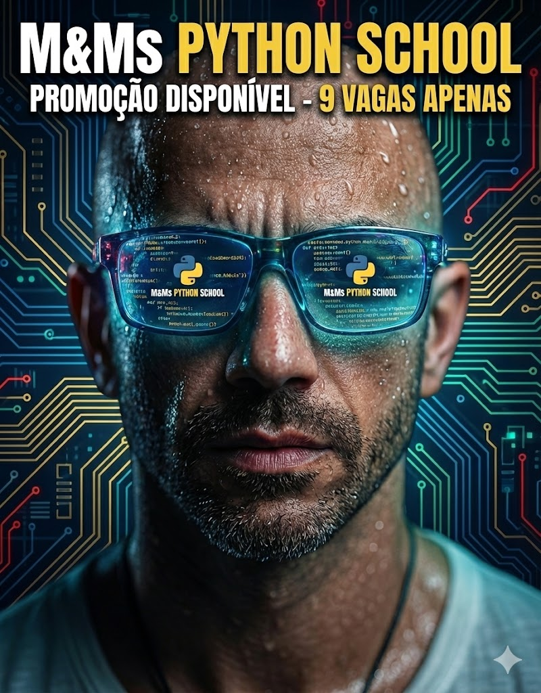
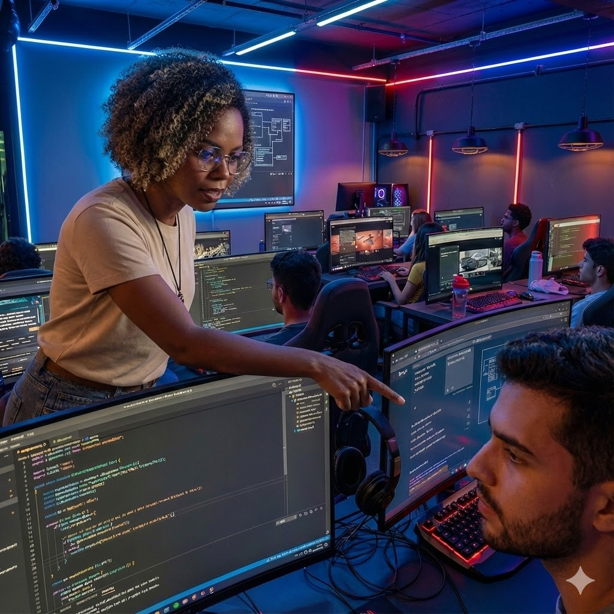

# M&Ms Python School - O Futuro é Fake Natty? 🐍🤖

## 📒 Descrição
Este projeto foi desenvolvido para o desafio "Natural ou Fake Natty" da DIO. A ideia foi criar a identidade visual e o conceito de uma Escola de Programação Futurista chamada **M&Ms Python School**. O objetivo era criar imagens tão realistas que gerassem a dúvida: "Essa escola existe mesmo ou foi gerada por IA?".

## 🤖 Tecnologias Utilizadas
* **IA Generativa de Imagem:** Gemini (Google) - Todas as imagens foram geradas nativamente pela IA.
* **IA Generativa de Texto:** Gemini (Google) - Roteirização, copy de vendas e conceitos.
* **Edição:** Canva (apenas para adicionar os textos e logos sobre as imagens geradas).

## 🧐 Processo de Criação
O processo criativo seguiu três etapas para garantir o realismo "Fake Natty":
1.  **Conceito:** Fugir do padrão corporativo e criar uma estética *Gamer/Cyberpunk* que conecta com o público jovem de tecnologia.
2.  **Prompt Engineering no Gemini:**
    * *Na Capa:* Foco em texturas de pele ultra-realistas (suor, poros) e reflexos complexos nos óculos AR.
    * *Na Sala de Aula:* Criação de uma professora com traços humanos imperfeitos e iluminação mista (neon + natural) para evitar o "efeito boneca".
3.  **Storytelling:** As imagens não são aleatórias; elas contam a história de uma escola onde a imersão é total.

## 🚀 Resultados

### 1. A Promessa (Marketing)
"Na M&Ms, você não apenas coda, você vive o código."

### 2. A Realidade (Sala de Aula)
Ambiente imersivo com mentoria personalizada. Observe o realismo da interação e iluminação.

## 💭 Reflexão
Este desafio demonstrou que a barreira entre o real e o digital está cada vez mais tênue. Utilizar apenas o Gemini para gerar tanto o visual quanto o textual provou a versatilidade da ferramenta em manter a consistência criativa do início ao fim.
